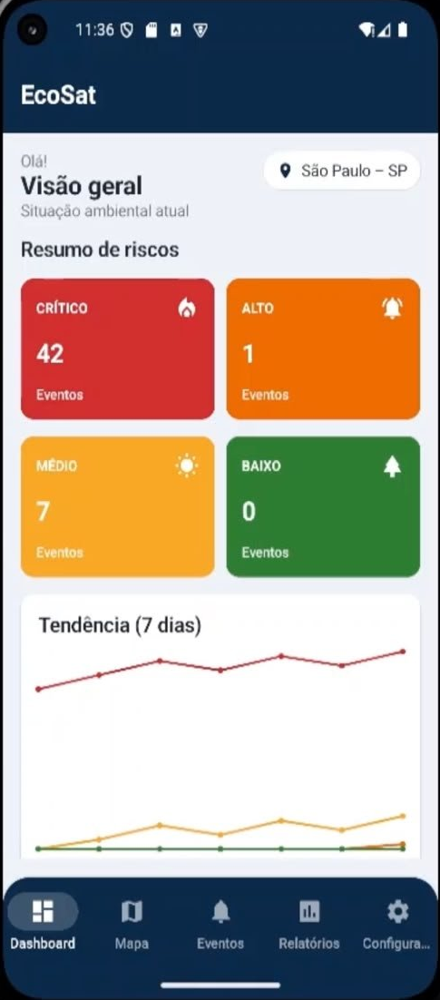
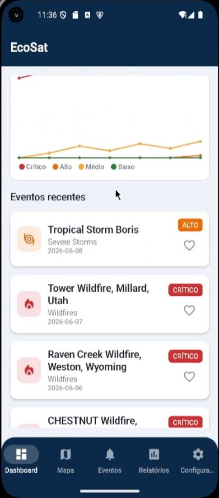
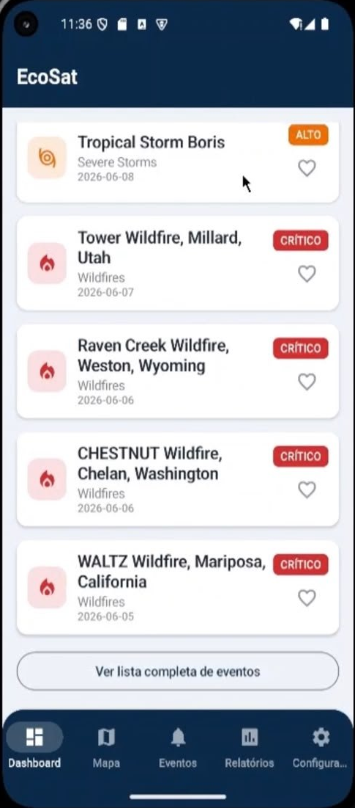
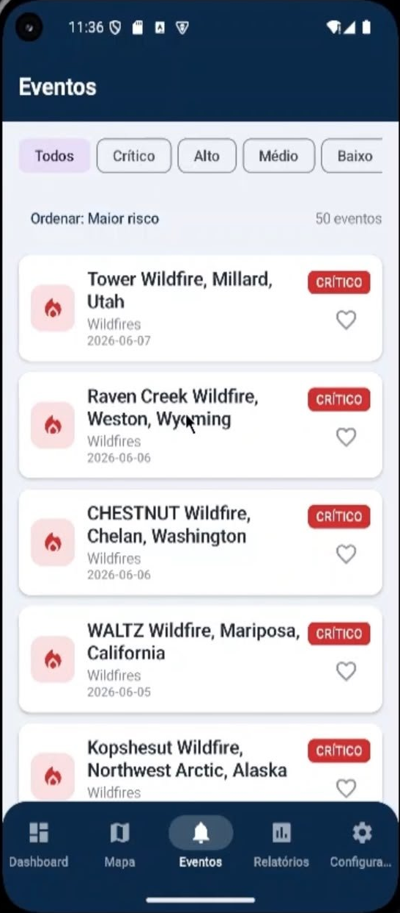
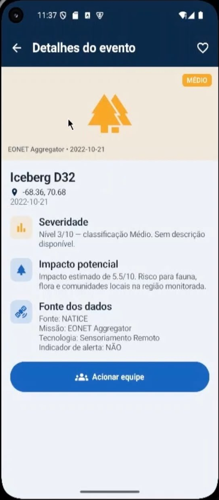
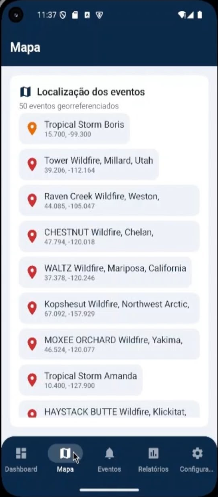
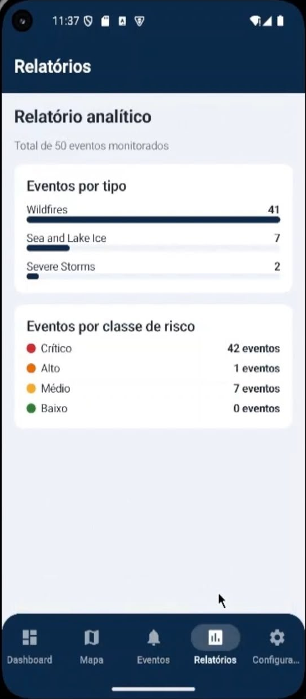
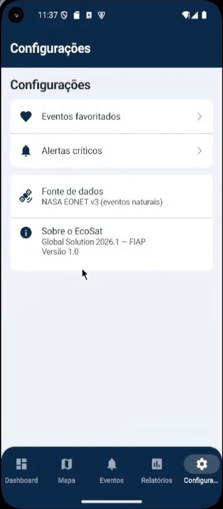

# 🛰️ EcoSat — Monitoramento Ambiental por Satélite

> Aplicativo Android desenvolvido para a **Global Solution 2026.1** da **FIAP**, no tema **Space Connect / Indústria Espacial**.
> Disciplina: **Mobile Application Development (Android Kotlin Developer)**.

O **EcoSat** é uma plataforma móvel que consome dados públicos de satélite da **NASA EONET** para identificar, classificar por risco e exibir eventos ambientais críticos (queimadas, tempestades severas, vulcões, enchentes, secas, entre outros), servindo como ferramenta de apoio à tomada de decisão da **Defesa Civil** municipal.

---

## 👥 Integrantes

|        Nome                   |    RM    |
|-------------------------------|----------|
| Pedro Henrique Lima           |  553664  |
| Maria Alice Sousa Santos      |  552717  |
| Thaís Mari Costa Lopes        |  553620  |

---

## 🎬 Vídeo Pitch

▶️ **Link do YouTube:** https://youtu.be/koZWrq3PH9E

---

## 🎯 O Problema

Eventos ambientais extremos — queimadas, enchentes, tempestades e secas — têm crescido em frequência e intensidade. Os órgãos de **Defesa Civil**, especialmente em municípios menores, muitas vezes não dispõem de uma ferramenta centralizada que reúna, em tempo quase real, os eventos ativos em uma região, classificados por gravidade. A informação existe (em fontes como a NASA), mas está dispersa e em formato técnico, dificultando a ação rápida.

## 💡 A Solução

O **EcoSat** centraliza esses dados em uma interface mobile simples e objetiva:

- Consome a API pública da **NASA EONET** (eventos naturais detectados por satélite);
- Aplica um **motor de classificação de risco** que transforma severidade e impacto em quatro níveis claros (Crítico, Alto, Médio, Baixo);
- Apresenta um **dashboard** com visão geral, gráfico de tendência e eventos recentes;
- Destaca **alertas críticos** e permite **favoritar** eventos para acompanhamento;
- Disponibiliza **relatórios** analíticos e a **localização georreferenciada** dos eventos.

### 🌐 Alinhamento com o tema "Space Connect / Indústria Espacial"

O projeto utiliza dados gerados pela **infraestrutura espacial** (satélites de observação da Terra da NASA) e os conecta a uma aplicação de impacto social direto, demonstrando como a indústria espacial gera valor prático para a sociedade.

---

## 🔄 Fluxo de Telas

O aplicativo segue o fluxo abaixo, do primeiro acesso até a navegação principal:

```
┌─────────┐     ┌──────────────┐     ┌───────────────────────────────────────┐
│ Splash  │ ──▶ │  Onboarding  │ ──▶ │            Tela Principal               │
│ (logo)  │     │ (1ª vez)     │     │        (Bottom Navigation)              │
└─────────┘     └──────────────┘     │                                         │
     │                               │  Dashboard · Mapa · Eventos ·           │
     │  (se onboarding já visto)     │  Relatórios · Ajustes                   │
     └──────────────────────────────▶│                                         │
                                      └───────────────────────────────────────┘
                                                        │
                          ┌─────────────────────────────┼─────────────────────────────┐
                          ▼                             ▼                             ▼
                   ┌──────────────┐            ┌──────────────┐             ┌──────────────┐
                   │   Detalhe    │            │    Alertas   │             │   Favoritos  │
                   │  do Evento   │            │   Críticos   │             │              │
                   └──────────────┘            └──────────────┘             └──────────────┘
```

**Detalhamento do fluxo:**

1. **Splash** → exibe o logo e, via `SharedPreferences`, decide o destino:
   - Primeiro acesso → **Onboarding**
   - Acesso recorrente → **Tela Principal**
2. **Onboarding** → 3 páginas explicando o app (avançar/voltar). Ao concluir, salva a flag em `SharedPreferences` e não exibe novamente.
3. **Tela Principal** → contém a *bottom navigation* com 5 abas: **Dashboard**, **Mapa**, **Eventos**, **Relatórios** e **Ajustes**.
4. A partir das abas, o usuário acessa telas de **push**: **Detalhe do Evento** (ao tocar em um card), **Alertas Críticos** e **Favoritos**.

---

## 📱 Prints das Telas

> As imagens estão na pasta `docs/screenshots/` do repositório.

### Dashboard

| Visão geral | Tendência | Eventos recentes |
|:-----------:|:---------:|:----------------:|
|  |  |  |

### Demais telas

| Eventos (lista + filtro) | Detalhe do Evento | Mapa |
|:------------------------:|:-----------------:|:----:|
|  |  |  |

| Relatórios | Configurações |
|:----------:|:-------------:|
|  |  |

---

## ✨ Funcionalidades

- 🔭 **Splash + Onboarding** — apresentação inicial do app
- 📊 **Dashboard** — resumo de riscos (cards Crítico/Alto/Médio/Baixo), gráfico de tendência (7 dias) e eventos recentes
- 🗺️ **Mapa** — listagem georreferenciada dos eventos (latitude/longitude)
- 📋 **Lista de Eventos** — com filtro por nível de risco e ordenação (maior risco / mais recentes)
- 🔎 **Detalhe do Evento** — severidade, impacto, fonte/missão/tecnologia e ação "Acionar equipe"
- 🔔 **Alertas Críticos** — eventos classificados como Alto ou Crítico
- ❤️ **Favoritos** — eventos salvos pelo usuário (persistência local)
- 📈 **Relatórios** — distribuição de eventos por tipo e por classe de risco
- ⚙️ **Ajustes** — informações sobre fonte de dados e o app

---

## 🏗️ Arquitetura

O projeto segue **Clean Architecture**, com separação clara em três camadas:

```
presentation  →  domain  ←  data
   (UI/VM)       (regras)    (API/local)
```

- **domain** — modelos, regras de negócio e casos de uso (independente de framework)
- **data** — fontes de dados (API NASA EONET via Retrofit, preferências locais), mapeamento e repositórios
- **presentation** — telas em Jetpack Compose, ViewModels e estados de UI

A injeção de dependência é feita com **Koin**, organizada em quatro módulos (`networkModule`, `dataModule`, `domainModule`, `presentationModule`).

### Motor de Classificação de Risco

| Classe | Critério |
|--------|----------|
| 🔴 **CRÍTICO** | severidade ≥ 9 **ou** impacto ≥ 8 |
| 🟠 **ALTO** | severidade 7–8 **ou** impacto 6–7,99 |
| 🟡 **MÉDIO** | severidade 4–6 **ou** impacto 4–5,99 |
| 🟢 **BAIXO** | demais casos |

---

## 🛠️ Tecnologias

| Categoria | Tecnologia |
|-----------|------------|
| Linguagem | **Kotlin** |
| UI | **Jetpack Compose** + Material 3 |
| Arquitetura | **Clean Architecture** (domain / data / presentation) |
| Injeção de Dependência | **Koin 4.0.0** |
| Rede | **Retrofit** + **OkHttp** |
| Serialização | **Kotlin Serialization** |
| Assincronismo | **Coroutines** + **StateFlow** |
| Navegação | **Navigation Compose** (bottom navigation com 5 abas) |
| Imagens | **Coil 3** |
| Persistência local | **SharedPreferences** |

---

## 🔌 API Utilizada

**NASA EONET v3** (Earth Observatory Natural Event Tracker)

- Endpoint: `https://eonet.gsfc.nasa.gov/api/v3/events`
- Pública, gratuita e **sem necessidade de chave de API**
- Fornece eventos naturais detectados por satélites (queimadas, vulcões, tempestades, etc.)

---

## ▶️ Como Executar

### Pré-requisitos
- Android Studio (versão Ladybug ou superior)
- JDK 17
- Emulador Android API 24+ ou dispositivo físico

### Passos
```bash
# 1. Clonar o repositório
git clone https://github.com/hPedro11/EcoSat.git

# 2. Abrir no Android Studio
#    File → Open → selecionar a pasta do projeto

# 3. Aguardar o Gradle sincronizar

# 4. Executar
#    Selecionar um emulador/dispositivo e clicar em Run ▶️
```

> Não é necessário configurar nenhuma chave de API — a NASA EONET é pública.

---

## 📁 Estrutura do Projeto

```
app/src/main/java/br/com/gs/ecosat/
├── EcoSatApplication.kt        # Inicialização do Koin
├── MainActivity.kt
├── domain/                     # Regras de negócio
│   ├── common/                 # Resource<T>
│   ├── model/                  # Event, RiskLevel
│   ├── repository/             # Interfaces
│   └── usecase/                # Casos de uso (ClassifyRisk, GetEvents, etc.)
├── data/                       # Acesso a dados
│   ├── model/                  # DTOs + mapeamento
│   ├── remote/                 # Retrofit (EONET API)
│   ├── local/                  # SharedPreferences
│   └── repository/             # Implementações
├── di/                         # Módulos Koin
└── presentation/               # Interface (Jetpack Compose)
    ├── common/                 # UiState + componentes reutilizáveis
    ├── navigation/             # Rotas + Bottom Navigation
    ├── theme/                  # Tema (cores, tipografia)
    └── event/                  # Telas (home, list, detail, alerts, etc.)
```

---

## 📄 Licença

Projeto acadêmico desenvolvido para fins educacionais — **FIAP, Global Solution 2026.1**.
